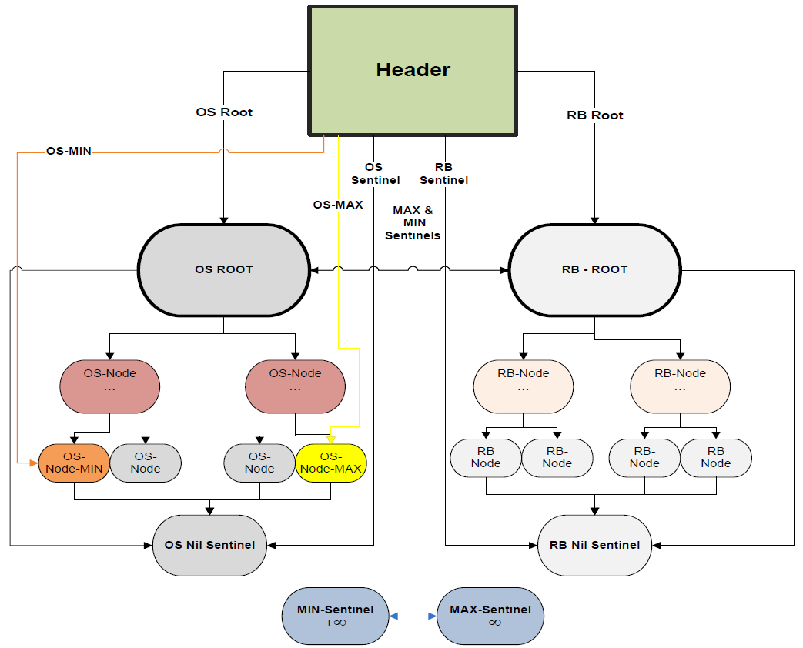

# Bank-account-management-with-OS-RB-TREE

## Description
The goal of this C project is managing a dynamic set of in-memory bank accounts :moneybag: proficiently as possible
(by run-time means, as a factor of set size, i.e., the amount of bank accounts in the set).
Managment of the dynamic set includes supporting the basic dictionary CRUD operations and additional custom queries, 
such as finding maximum account in the set & finding all accounts which contain a negative balance. 

Considering the tradeoffs of different data-structures for the problem in hand, 
those which were found as most appropriate were [Red-Black](https://en.wikipedia.org/wiki/Red-black_tree) :red_circle::black_circle: and [Order-Statistic](https://en.wikipedia.org/wiki/Order_statistic_tree) :bar_chart: balanced :balance_scale: binary-search trees :palm_tree:.
These data-structures are fully implemented in this project from scratch, based on the pseudo-code of [CLRS](https://en.wikipedia.org/wiki/Introduction_to_Algorithms). 
With these data-structures all basic dictonary operations & queries take O(lgN) at most (where N is size of the dynamic set), 
while some (such as querying the max key record) take only constant time O(1). 
Besides these, the query which enumerates all M records with a negtive balance requires O(M+lgN). 

Inorder to enable these optimized run times for queries both by Account *id* and Account *balance*,
the program maintains _two_ red-black trees: one manages all records in the set by balance as the primary key of the records, 
and other serves as an index and manages a light-weight version of the records by accout id as a primary key. 
Both are pointing towards each-other between parallel nodes inorder to keep in sync and bind the data regardless the index (tree) used. 

For further details of the considerations taken, runtime analysis and so forth, see: [detailed documentation :bookmark_tabs:](DetaildDocumentation/%D7%9E%D7%9E%D7%9F%2018%20-%202016%D7%90.pdf)

## Naming Convention 
The following two conventions are used in this project:
* **OS**-Tree: **O**rder-**S**tatistic Tree (which is an extended red-black balanced binary search tree). 
* **RB**-Tree: **R**ed-**B**lack Tree balanced binary search tree.

## Modules 
| Module         | Files                                                | Content & Responsibility                                                                                                       |
|----------------|------------------------------------------------------|--------------------------------------------------------------------------------------------------------------------------------|
| IO_UTILS       | [io_utils.c](io_utils.c), [io_utils.h](io_utils.h)   | I/O Interaction, Validations & Global Configurations                                                                           |
| OS_TREE        | [os_tree.c](os_tree.c), [os_tree.h](os_tree.h)       | Index Records by Account Balance, Support RB & OS Operations (CRUD, Queries, Rotations, Rank,..., Including Enumerating Ranges | 
| RB_TREE        | [rb_tree.c](rb_tree.c), [rb_tree.h](rb_tree.h)       | Index Records by Account Id, Support RB Operations & Bind to OS Tree for Staying in Sync                                       |                       
| MAIN           | [main.c](main.c)                                     | Initialization, Memory Management, Controller of Program Flow, Output Log                                                      |

## Input/Output Examples 
- **[Example 1](IOExamples/Example1)**
    - [File1 *Input*](IOExamples/Example1/chanan_example.txt)
    - [File1 *Output*](IOExamples/Example1/chanan_example.txt_Sun%20Mar%2013_output.txt) 
- **[Example 2](IOExamples/Example2)**
    - [File2 *Input*](IOExamples/Example2/maman_example.txt)
    - [File2 *Output*](IOExamples/Example2/maman_example.txt_Sun%20Mar%2013_output.txt) 
    
## Schematic Diagram Of The Data-Structures

## Standard Red-Black Tree
A standard red-black binary search tree:

